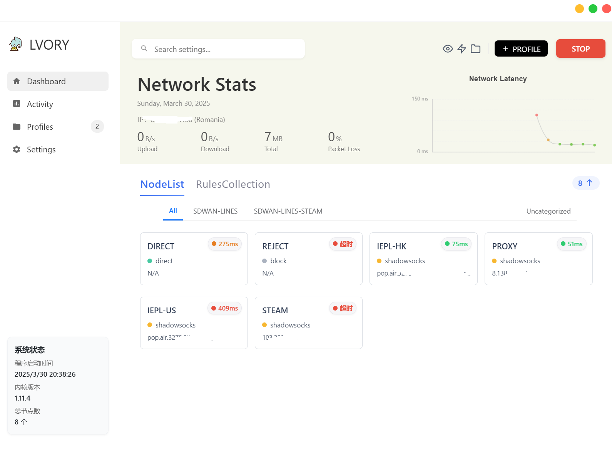

# Lvory

*跨平台 Singbox 客户端*

 
 

[截图预览](docs/screenshot.md) • [文档](docs/) • [常见问题](docs/faq.md)

## 功能特性

Lvory 是一个基于 Electron 开发的高度灵活的跨平台 SingBox 客户端，**面向具有自建节点能力的技术向用户**。

### 核心功能

| 功能 | 描述 |
|---------|-------------|
| **自动内核管理** | 自动下载、安装和更新 SingBox 内核 |
| **代理管理** | 一键启用/禁用系统代理，自动端口检测 |
| **配置管理** | 多配置支持，自动解析节点并显示 |
| **自动更新** | 定时自动更新配置文件 |
| **活动日志** | 实时 SingBox 运行日志和系统活动 |
| **高度灵活** | 基于文件操作，UI 辅助，最大化灵活性 |

## 预览

*主仪表板界面*

更多截图请查看 [更多截图](docs/screenshot.md)   

或者也可以通过 [#42](https://github.com/sxueck/lvory/issues/42) 查看程序实际运行的效果

## 快速开始

### 系统要求

- **操作系统**: Windows 10+、macOS 10.15+ 或 Linux
- **SingBox**: 由 Lvory 自动管理

### 安装

从 [GitHub Releases](https://github.com/sxueck/lvory/releases) 页面下载最新版本。

选择适合您操作系统的安装包，日常构建版本通常是基于每次 main 分支的提交都会进行一次编译，其会包含实时最新开发特性，但也包含例如无法启动或者包含严重 Bug 等风险，而 RC 版本则代表经过简单测试未发现问题后编译版本，Stable 则是正式可完全日常使用的版本

### 快速使用

1. **启动 Lvory** - 启动应用程序
2. **添加配置** - 导入您的 SingBox 配置文件
3. **启用代理** - 一键切换系统代理
4. **监控活动** - 查看实时日志和连接状态

### Lvory 协议支持

Lvory 支持专门的同步协议，用于智能管理多源代理配置：

- **多源节点池**：从多个订阅源自动获取和更新节点信息
- **智能匹配**：通过节点名称等标识符自动匹配和同步节点
- **声明式配置**：使用简单的配置文件管理复杂的代理架构
- **自动同步**：定时检查配置源更新，保持配置最新状态

具体的声明和使用方式请参考：[Lvory 同步协议文档](docs/program/lvory-sync-protocol.md)

### 内核管理

Lvory 会自动下载和管理 SingBox 内核，通常情况下用户无需关心这部分，但是同时也支持让用户自行下载或者更换内核，具体可以参考该 [issue](https://github.com/sxueck/lvory/issues/21)

### 架构文档

- **[配置引擎设计 - Alpha](docs/program/profiles_engine.md)**  
  配置映射引擎原型和实现细节

- **[节点评分算法 - Alpha](docs/program/node_score.md)**  
  代理节点评分算法和工作流程文档

### 开发环境搭建

具体的构建编译可以参考 Github Actions 声明

## 免责声明

> **重要提示**: 使用前请仔细阅读。

1. **教学目的**: 该项目及其文档仅用于技术研究、讨论和学习目的，不构成商业或法律建议。

2. **无保证**: 作者和维护者对使用该项目可能造成的任何直接、间接、偶然或后果性损害、数据丢失或系统故障不承担责任。

3. **法律合规**: 该项目不得用于任何非法、未经授权或违反法规的活动。此类误用产生的责任完全由用户承担。

4. **用户责任**: 用户在使用该项目时有责任确保遵守所有适用的法律、法规和行业标准。

## 许可证

该项目基于 Apache License 2.0 许可证 - 详情请查看 [LICENSE](LICENSE) 文件。
