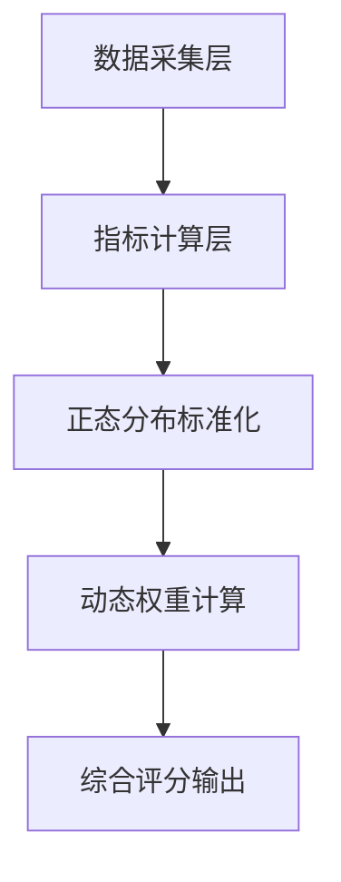
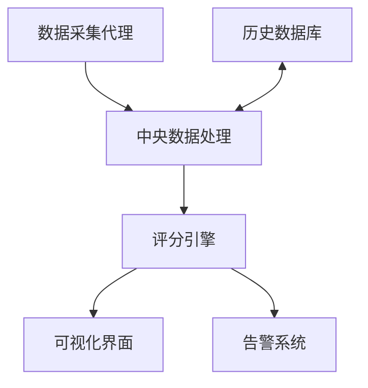

# 代理节点延迟评估与打分算法 - Alpha

## 1. 算法概述

算法旨在对代理节点进行全面评估，通过多维度指标和动态计算方法，实现对节点服务质量的精准打分。基于正态分布模型的动态权重系统，能够在保证评分稳定性的同时，对节点性能波动做出敏感响应



## 2. 评估指标体系

### 2.1 基础指标与默认权重

| 指标名称 | 权重占比 | 说明 |
|---------|---------|------|
| 延迟 | 37% | 节点响应时间，单位ms |
| 丢包率 | 30% | 数据包传输丢失比例 |
| 节点位置 | 15% | 地理位置评估 |
| IP变更次数 | 6% | 节点IP稳定性 |
| IP纯净度 | 12% | IP地址质量评估 |

### 2.2 单项指标评分标准

#### 2.2.1 延迟评分
- ≤50ms: 100分（极佳）
- 50-100ms: 80分（良好）
- 100-200ms: 60分（一般）
- >200ms: 30分（较差）

#### 2.2.2 丢包率评分
- ≤1%: 100分（极佳）
- 1%-3%: 80分（良好）
- 3%-5%: 50分（一般）
- >5%: 0分（不可用）

#### 2.2.3 位置评分
- 最优区域: 100分
- 次优区域: 70分
- 普通区域: 40分

#### 2.2.4 IP变更评分
- 月变更≤1次: 100分（极稳定）
- 2-3次: 80分（稳定）
- 4-5次: 50分（一般）
- 小于5次: 20分（不稳定）

#### 2.2.5 IP纯净度评分
- 家庭 ISP IP且纯净度低于 15%: 100分（优质）
- IDC 宽带 IP: 60分（一般）
- 高风险 IP: 0分（风险）

## 3. 正态分布动态评分模型

### 3.1 正态化处理原理

标准化评分通过正态分布模型对原始数据进行处理，将各项指标转换为标准得分（Z-score），然后映射到累积分布函数上获得最终评分。

计算步骤如下：

1. **计算Z-score**:
   \[ Z = \frac{x - \mu}{\sigma} \]
   
   其中:
   - x: 当前指标测量值
   - μ: 滑动窗口内该指标的平均值
   - σ: 滑动窗口内该指标的标准差

2. **标准化评分计算**:
   \[ 标准化评分 = (1 - \Phi(|Z|)) \times 100 \]
   
   其中:
   - Φ: 标准正态分布的累积分布函数
   - |Z|: Z-score的绝对值

### 3.2 动态权重调整机制

为了体现数据的动态变化，系统基于历史波动性调整各指标权重:

\[ 动态权重系数 = \frac{1}{当前指标\sigma / 历史\sigma} \]

\[ 最终权重 = 基础权重 \times 动态系数 \]

\[ 归一化权重 = \frac{最终权重}{\sum 所有指标最终权重} \]

## 4. 综合评分计算公式

\[ 总分 = \sum_{i=1}^{n} (标准化评分_i \times 归一化权重_i) \]

其中:
- n: 指标总数 (n=5)
- 标准化评分_i: 第i个指标的标准化评分
- 归一化权重_i: 第i个指标的归一化权重

## 5. 数据采集与处理机制

### 5.1 滑动窗口参数

- **窗口大小**: 24小时
- **采样频率**: 5分钟/次
- **更新频率**: 1小时/次

### 5.2 数据异常处理

1. **异常值检测**: 
   - 使用3σ原则识别异常值
   - Z-score > 3或< -3的数据点标记为异常

2. **异常处理策略**:
   - 单点异常: 使用插值替代
   - 连续异常: 触发告警并降低其在评分中的权重

## 6. 实施建议

### 6.1 部署架构



### 6.2 优化策略

1. **差异化阈值设置**:
   - 为不同地区、不同类型的代理设置差异化评分标准
   - 根据用户业务类型调整指标权重

2. **季节性调整**:
   - 识别指标的时间模式（如工作日/周末差异）
   - 根据季节性模式调整μ和σ的计算

3. **人工干预机制**:
   - 设置管理员权限覆盖异常评分
   - 针对特殊事件（如大规模网络维护）的评分调整机制

## 7. 参考实现

### 7.1 伪代码示例

```python
# 数据采集
def collect_metrics(node_id):
    return {
        'latency': measure_latency(node_id),
        'packet_loss': measure_packet_loss(node_id),
        'location': get_location_score(node_id),
        'ip_changes': count_ip_changes(node_id),
        'ip_cleanliness': evaluate_ip_cleanliness(node_id)
    }

# 计算Z-score
def calculate_z_score(value, metric_name):
    mean = get_sliding_window_mean(metric_name)
    std_dev = get_sliding_window_std_dev(metric_name)
    return (value - mean) / std_dev

# 标准化评分
def normalize_score(z_score):
    return (1 - cumulative_normal_distribution(abs(z_score))) * 100

# 动态权重计算
def calculate_dynamic_weight(metric_name, base_weight):
    current_std_dev = get_sliding_window_std_dev(metric_name)
    historical_std_dev = get_historical_std_dev(metric_name)
    dynamic_factor = 1 / (current_std_dev / historical_std_dev)
    return base_weight * dynamic_factor

# 归一化权重
def normalize_weights(weight_dict):
    total = sum(weight_dict.values())
    return {k: v/total for k, v in weight_dict.items()}

# 总评分计算
def calculate_final_score(normalized_scores, normalized_weights):
    return sum(normalized_scores[metric] * normalized_weights[metric] 
               for metric in normalized_scores)
```

## 8. 总结

算法通过结合正态分布模型和动态权重机制，为代理节点延迟评估提供了一套全面、客观、灵敏的评分体系。该体系具有以下特点：

1. **多维度评估**: 综合考虑延迟、丢包率、地理位置等多个性能指标
2. **动态适应性**: 通过正态分布模型对数据波动做出敏感响应
3. **自平衡机制**: 动态权重根据数据稳定性自动调整影响力
4. **异常处理能力**: 对极端数据和连续异常有检测和处理机制
